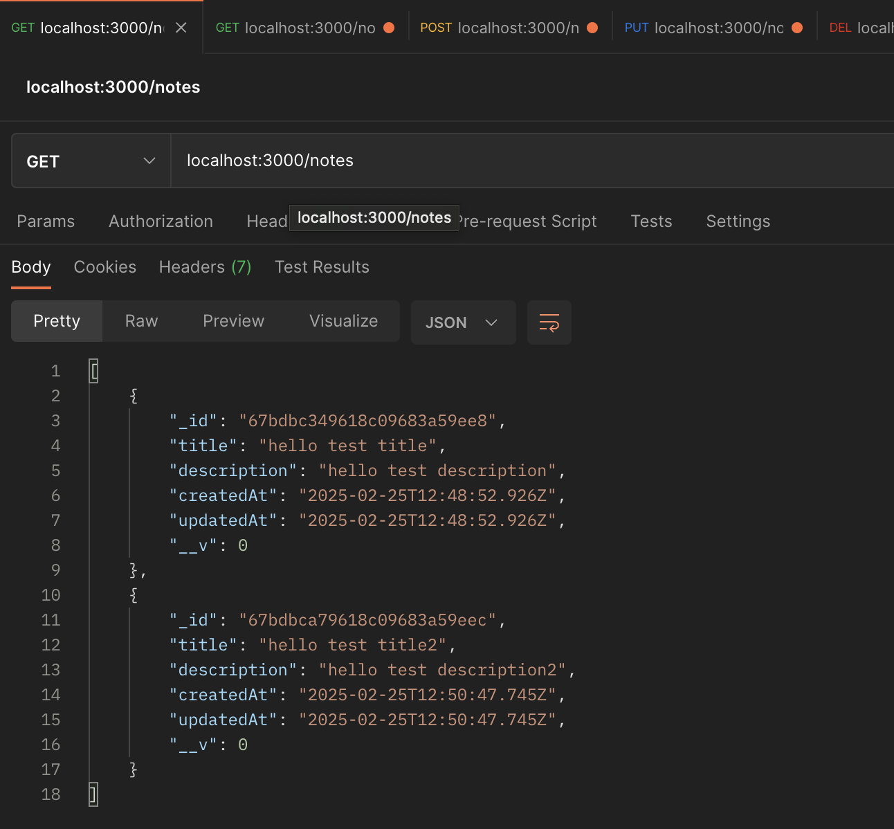
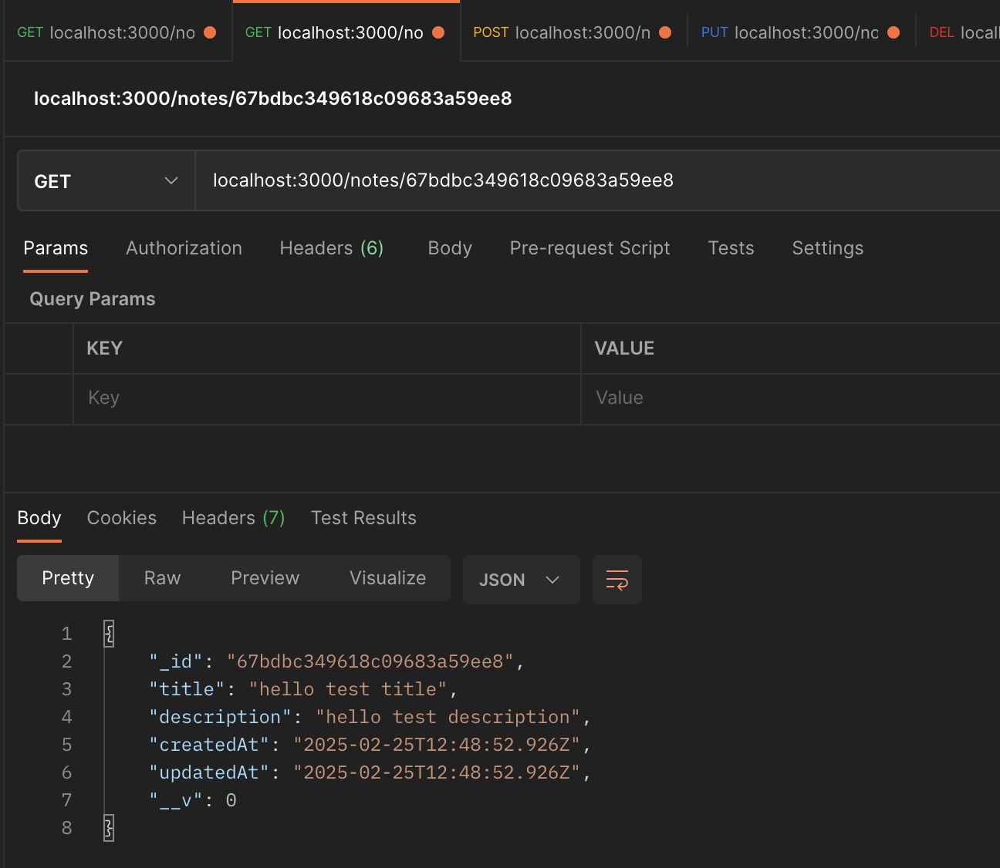
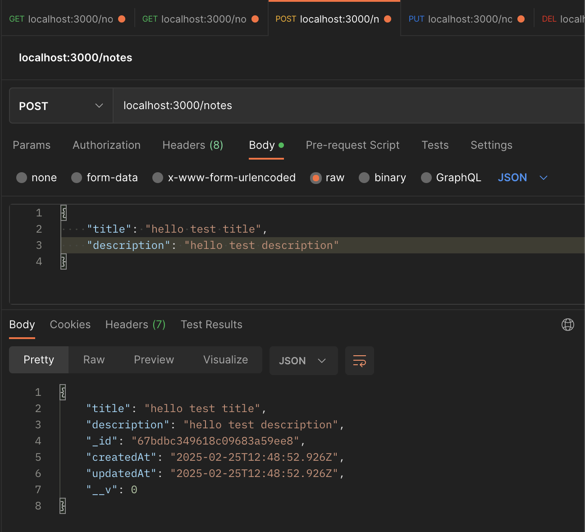
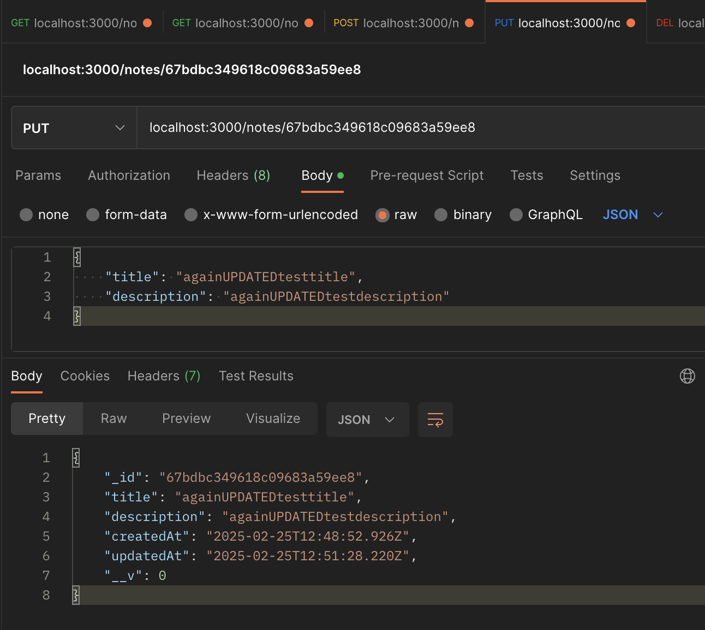
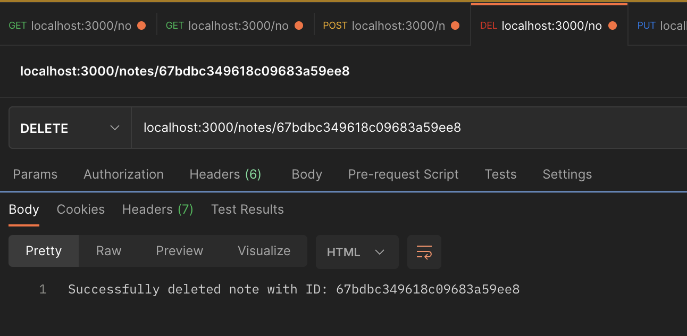

# ivim-ASSESSMENT-BE_I
## Backend application built using Node.js, Express, and MongoDB that handles basic CRUD for notes. Tested using Jest, Supertest, and Testcontainers and containerized with Docker.
### Total time spent: ~6 hours
## To get started
1. Clone the repository to desired local directory
  ```sh
  git clone https://github.com/aperng31/ivim-ASSESSMENT-BE_I.git
  ```  
  - you can also find this HTTPS URL under "Local" -> "HTTPS" tab
2. Navigate to the project directory.
3. Ensure docker is already installed on your machine.
  - https://docs.docker.com/get-started/get-docker/
4. Run
  ```sh
  docker compose up -d --build
  ```
  - This will spin-up a MongoDB service and run the app in the same container!
5. The app is available at localhost:3000

- To stop the container, run
  ```sh
  docker compose stop
  ```
- To restart up the container, run
  ```sh
  docker compose start
  ```
- To completely shut down the container, run
  ```sh
  docker compose down
  ```

## Running Tests
- Note that docker is also needed to the run the tests, as Testcontainers (https://testcontainers.com/) is used to test the routes.
1. Run
  ```sh
  npm run test
  ```

## API Endpoints
- **GET /notes** - Retrieve all notes.

- **GET /notes/:id** - Retrieve a single note by ID.

- **POST /notes** - Create a new note.

- **PUT /notes/:id** - Update an existing note by ID.

- **DELETE /notes/:id** - Delete a note by ID.

